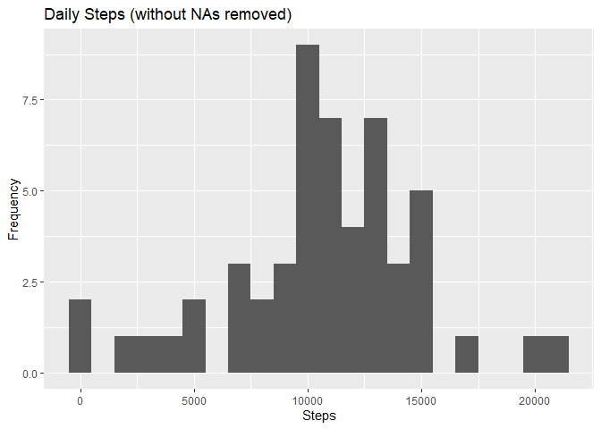
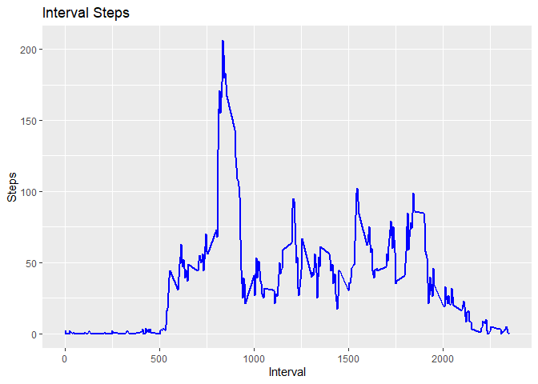
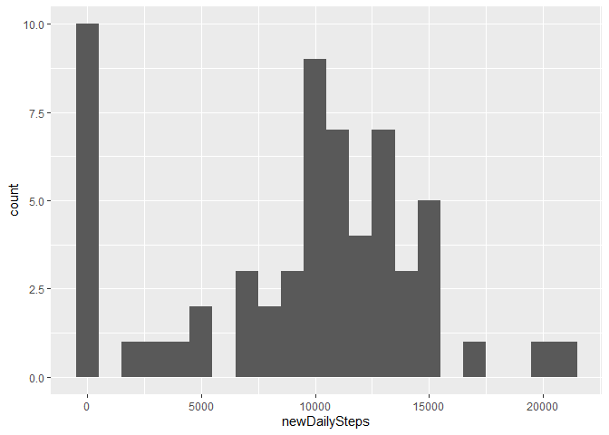
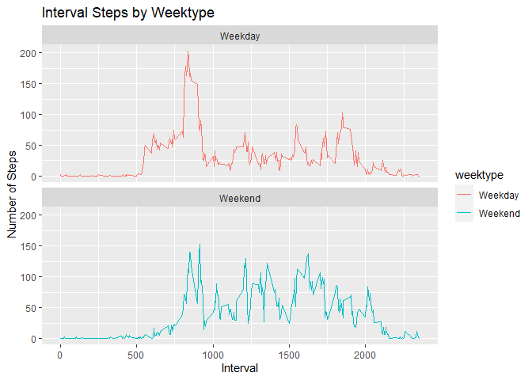

## Loading and preprocessing the data

```r
library(dplyr)
```

```
## 
## Attaching package: 'dplyr'
```

```
## The following objects are masked from 'package:stats':
## 
##     filter, lag
```

```
## The following objects are masked from 'package:base':
## 
##     intersect, setdiff, setequal, union
```

```r
library(ggplot2)
```


```r
Url <- "https://d396qusza40orc.cloudfront.net/repdata%2Fdata%2Factivity.zip"
download.file(Url, destfile = paste0(getwd(), '/repdata%2Fdata%2Factivity.zip'))
unzip("repdata%2Fdata%2Factivity.zip",exdir = "data")
```

Loading the data

```r
dt <- read.csv("data/activity.csv")
```


## What is mean total number of steps taken per day?

1. Calculate the total number of steps taken per day

```r
daily.steps <- dt %>% 
  group_by(date) %>% 
  summarise(dailySteps = sum(steps))
head(daily.steps)
```

```
## # A tibble: 6 x 2
##   date       dailySteps
##   <chr>           <int>
## 1 2012-10-01         NA
## 2 2012-10-02        126
## 3 2012-10-03      11352
## 4 2012-10-04      12116
## 5 2012-10-05      13294
## 6 2012-10-06      15420
```

2. Make a histogram of the total number of steps taken each day

```r
ggplot(daily.steps, aes(x=dailySteps))+
  geom_histogram(binwidth = 1000)+
  labs(title = "Daily Steps (without NAs removed)",
       x = "Steps", y = "Frequency")
```

```
## Warning: Removed 8 rows containing non-finite values (stat_bin).
```

<!-- -->

3. Calculate and report the mean and median of the total number of steps taken per day

```r
daily.steps %>% 
  summarise(dailyStepsMean = mean(dailySteps, na.rm = TRUE),
            dailyStepsMedian = median(dailySteps, na.rm = TRUE))
```

```
## # A tibble: 1 x 2
##   dailyStepsMean dailyStepsMedian
##            <dbl>            <int>
## 1         10766.            10765
```


## What is the average daily activity pattern?

1. Make a time series plot (i.e. \color{red}{\verb|type = "l"|}type = "l") of the 5-minute interval (x-axis) and the average number of steps taken, averaged across all days (y-axis)

```r
interval.steps <- dt %>% 
  group_by(interval) %>% 
  summarise(intervalSteps = round(mean(steps, na.rm = TRUE)))

ggplot(interval.steps, aes(x = interval, y = intervalSteps))+
  geom_line(color = "blue", size = 1)+
  labs(title = "Interval Steps", x = "Interval", y = "Steps")
```

<!-- -->

2. Which 5-minute interval, on average across all the days in the dataset, contains the maximum number of steps?

```r
interval.steps %>% 
  filter(intervalSteps == max(intervalSteps)) %>% 
  mutate(maxInterval = interval, .keep = "none")
```

```
## # A tibble: 1 x 1
##   maxInterval
##         <int>
## 1         835
```


## Imputing missing values

1. Calculate and report the total number of missing values in the dataset (i.e. the total number of rows with \color{red}{\verb|NA|}NAs)

```r
sum(!complete.cases(dt))
```

```
## [1] 2304
```

2. Devise a strategy for filling in all of the missing values in the dataset. The strategy does not need to be sophisticated. For example, you could use the mean/median for that day, or the mean for that 5-minute interval, etc.


```r
dt$steps[is.na(dt$steps)] <- round(median(dt$steps, na.rm = TRUE))
```

3. Create a new dataset that is equal to the original dataset but with the missing data filled in

```r
write.csv(dt,"data/NAImpute_Activity.csv", row.names = FALSE, quote = FALSE)
```

4. Make a histogram of the total number of steps taken each day and Calculate and report the **mean** and **median** total number of steps taken per day. Do these values differ from the estimates from the first part of the assignment? What is the impact of imputing missing data on the estimates of the total daily number of steps?

```r
noNAdt <- read.csv("data/NAImpute_Activity.csv")

new.daily.steps <- noNAdt %>% 
  group_by(date) %>% 
  summarise(newDailySteps = sum(steps))

ggplot(new.daily.steps, aes(x = newDailySteps)) +
  geom_histogram(binwidth = 1000)
```

<!-- -->

```r
new.daily.steps %>% 
  summarise(newMeanDailySteps = mean(newDailySteps),
            newMedianDailySteps = median(newDailySteps))
```

```
## # A tibble: 1 x 2
##   newMeanDailySteps newMedianDailySteps
##               <dbl>               <int>
## 1             9354.               10395
```

|   Estimates of the total daily number of steps| mean steps | median steps |   |   |
|---|---|---|---|---|
| With NAs| 10766 | 10765 |   |   |
| Fill in NAs with median | 93542| 10395 |   |   |
|   |   |   |   |   |

Estimates of the total daily number of steps in the data with missing values (mean and median) are higher when compared to 
data that was imputed with mean (or median).


## Are there differences in activity patterns between weekdays and weekends?

1.  Create a new factor variable in the dataset with two levels – “weekday” and “weekend” indicating whether a given date is a weekday or weekend day.

```r
noNAdt$date <- as.POSIXct(noNAdt$date, format = "%Y-%m-%d")
day.of.week <- noNAdt %>% 
  mutate(Day_of_week = weekdays(date)) %>% 
  mutate("weektype" = ifelse(Day_of_week == "Saturday"| Day_of_week == "Sunday","Weekend", "Weekday"))

head(day.of.week)
```

```
##   steps       date interval Day_of_week weektype
## 1     0 2012-10-01        0      Monday  Weekday
## 2     0 2012-10-01        5      Monday  Weekday
## 3     0 2012-10-01       10      Monday  Weekday
## 4     0 2012-10-01       15      Monday  Weekday
## 5     0 2012-10-01       20      Monday  Weekday
## 6     0 2012-10-01       25      Monday  Weekday
```

2. Make a panel plot containing a time series plot (i.e. type = "l") of the 5-minute interval (x-axis) and the average number of steps taken, averaged across all weekday days or weekend days (y-axis). 

```r
daily_steps_week <- day.of.week %>% 
  group_by(interval, weektype) %>% 
  summarise(steps = round(mean(steps)))
```

```
## `summarise()` has grouped output by 'interval'. You can override using the `.groups` argument.
```

```r
## making plot
ggplot(daily_steps_week, aes(x = interval, y = steps, color = weektype))+
  geom_line()+
  labs(title = "Interval Steps by Weektype", x = "Interval", y = "Number of Steps")+
  facet_wrap(~weektype, ncol = 1, nrow = 2)
```

<!-- -->

